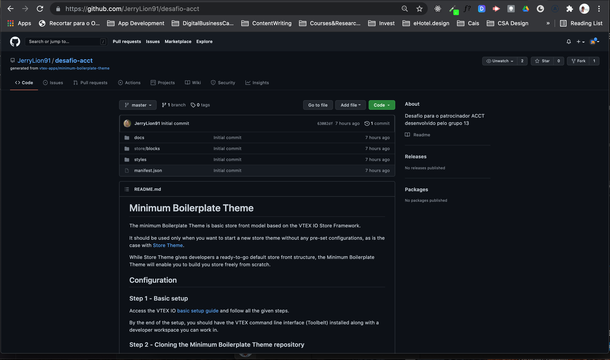
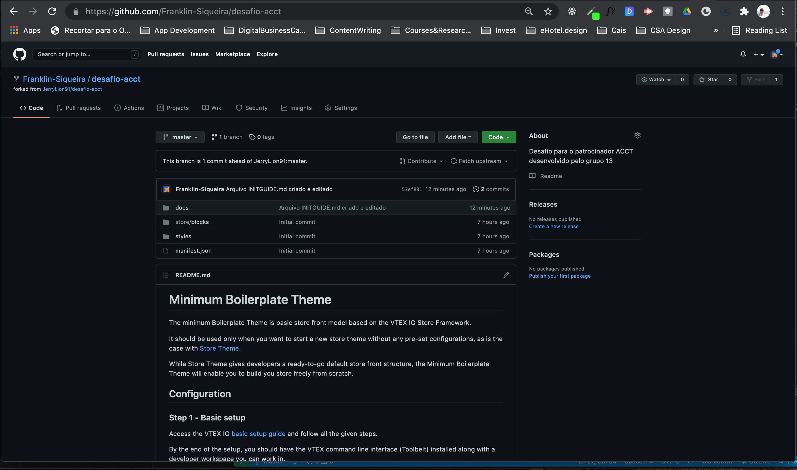

# Desafio ACCT | Hiring Coders 2021 | Gama Academy | 08/2021

## Passos para fazer contribuições no projeto

1. **Fork** do projeto para o Github do componente do grupo (teamate)

Estando no repositório do projeto, observe o botão *fork* canto superior direito da tela do seu navegador. Clique nesse botão para criar uma cópia para a sua conta no Github.com;

2. **Clone** do projeto para desenvolvimento em sua máquina

Vá para o **repositório** criado em sua conta. Já na tela do repositório copiado, observe o botão *code* (em algumas telas ele será um botão verde, no lado direito, na quarta linha da tela do navegador. Ao clicar nesse botão, irá aparecer um trecho de código com a seguinte aparência:

        https: //github.com/<conta_github>/desafio-acct.git

Onde, a **conta_github** é a sua conta na plataforma (Github). Copie esse trecho e vá para o *command line interface* (CLI) da sua máquina (Terminal, no Mac OS, por exemplo).

Em seguida, na *pasta/diretório* em que pretende desenvolver o projeto, digite:
    
        *git clone https: //github.com/<**conta_github**>/desafio-acct.git*

3. **Push** das alterações feitas para o repositório **remoto**

Após fazer as alterações relativas a sua parte no **projeto**:

Prepare as alterações para o *upload*, usando os commandos *git add .* e *git commit*. No que diz respeito ao **commit**, lembre-se de comentar apropriadamente, descrevendo o que foi feito nesse estágio do seu código;

Usando o comando *git push -u origin master*, faça o **upload** das alterações feitas.

4. Finalmente, registre (**open**) o **Pull request** das alterações efetuadas

Na janela do navegador, no seu *repositório* no **Github.com**, clique no botão **contribute** e siga os passos indicados.

5. Sugestões

Por fim, fiquem à vontade para propor alterações no fluxo de trabalho.

Lembrando que, como se trata de um trabalho em grupo, o mínimo de organização se faz necessário, levando-se em consideração que nem todos do time estão disponíveis a qualquer momento do dia, ou da noite.

Ou seja, é preciso considerar que nem sempre a comunicação se dará de forma síncrona e o código precisa rodar sem erros.